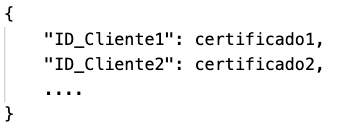
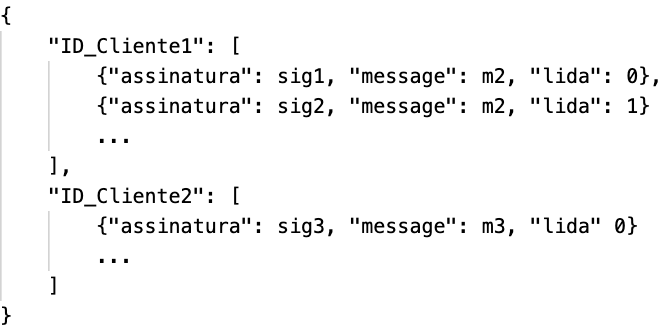
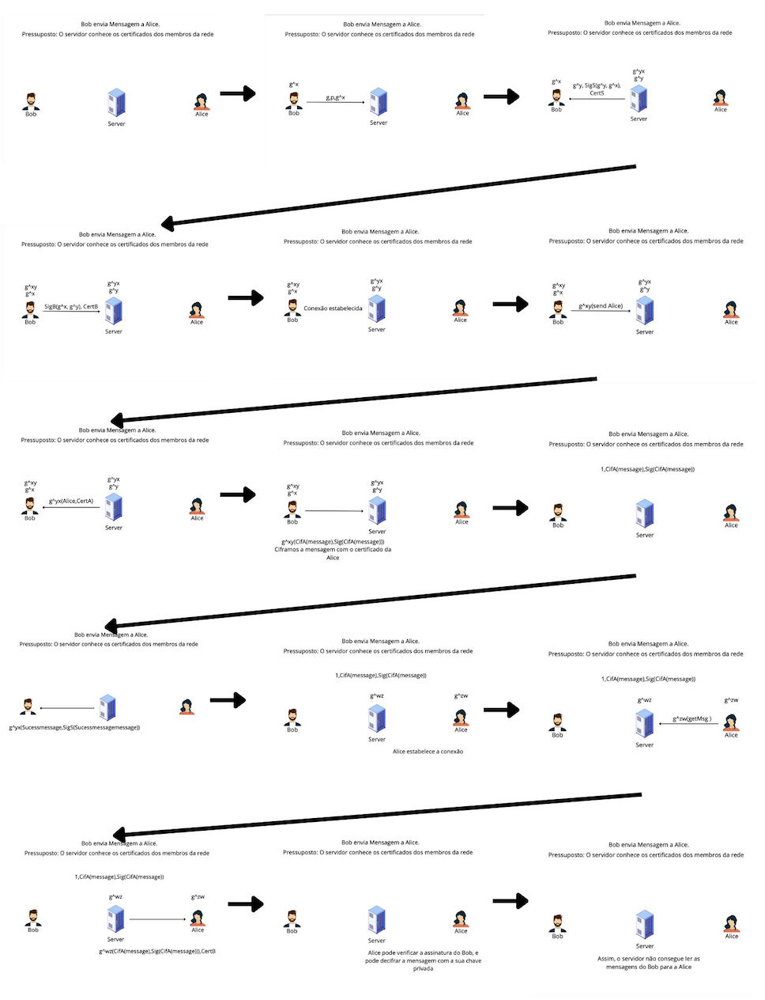
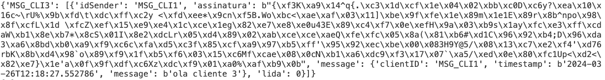

# Projecto de Criptografia Aplicada - 23/24

**Autores:** João Magalhães, Jorge Rodrigues e Rodrigo Gomes

Universidade do Minho, Braga Gualtar, Portugal

## Abstract
A pedido da UC de Segurança de Sistemas Informáticos, construiu-se um serviço de Message Relay, que permita aos membros de uma organização trocarem mensagens com garantias de autenticidade e integridade dos dados transmitidos.

**Keywords:** Serviço, Troca de mensagens, Autenticidade e Integridade

## Introdução
No mundo digital, a troca de mensagens entre utilizadores é uma prática fundamental. No entanto, garantir a segurança e autenticidade dessas comunicações tornou-se uma preocupação crescente. Este projeto propõe a criação de um serviço de Message Relay, que visa oferecer aos utilizadores uma plataforma segura para a troca de mensagens, com a garantia de autenticidade e integridade dos dados transmitidos.
Este serviço consiste em dois componentes principais: um servidor `msg_server.py` e um cliente `msg_client.py`. A comunicação entre ambos é assegurada por um grupo de comandos que serão explicados ao longo do relatório, bem como as decisões tomadas pelo grupo para obter o resultado pretendido.
Para rematar, o projeto contém uma secção de valorações dos tópicos que o grupo se desafiou a concluir, de forma a que a troca de mensagens fosse aprimorada.

## Dicionários utilizados
### Dicionário dos certificados (`dicionario_certClientes`)
Este dicionário armazena os certificados de cada cliente, organizados por seu respetivo ID e certificado. Optamos por criar essa estrutura para os certificados, a fim de evitar a repetição de informações caso não fosse utilizado esse dicionário.

   

### Dicionário das mensagens (`dicionario_infoLeitura`)
Este dicionário desempenha um papel crucial na comunicação entre o servidor e o cliente. Como podemos ver na figura, é estruturado inicialmente pelo ID do cliente destinatário das mensagens, acompanhado por um `array`, contendo informações relevantes. Essas informações incluem o número da mensagem na `queue` do próprio cliente, o ID do remetente da mensagem, permitindo o acesso ao seu certificado por meio de outro dicionário já mencionado, a assinatura do remetente para verificar a autenticidade das mensagens e, por fim, o conteúdo da mensagem a ser enviada ao cliente. Foi adicionado um campo "lida" (0 = mensagem por ler, 1 = mensagem lida) ao dicionário para facilitar um comando a executar. Esta decisão será futuramente explicada.

Inicialmente o grupo tinha dois dicionários, um para as mensagens lidas e outro para as mensagens por ler, não necessitando assim deste campo extra "lida". No entanto, tal decisão levou nos a alguns problemas de numeração das mensagens e repetição de informações guardadas, por isso, decidimos que um dicionário seria suficiente e resolvia o problema.

    

## Conexão cliente-servidor
Para estabelecer a conexão entre o cliente e o servidor é necessária uma troca de mensagens para realizar o acordo de chaves Diffie-Hellman e autenticar as partes envolvidas. Este processo é dado no projeto, pelos seguintes passos:

### Cliente
1. Envio dos parâmetros p e g para o servidor: Depois do servidor estar à espera de mensagens, o cliente inicia a conexão enviando os parâmetros p e g para o servidor. Estes parâmetros são necessários para o acordo de chaves Diffie-Hellman. Apesar de nas aulas práticas utilizarmos estes valores fixos para todas as interações, fizemos uma função que calcula os valores para cada inicialização do cliente, tornando o sistema mais seguro.
2. Receção da resposta do servidor: O cliente recebe a resposta do servidor, que contém a chave pública do mesmo, a sua assinatura e certificado.
3. Validação do certificado do servidor: O cliente valida a resposta recebida. Isso envolve verificar a assinatura usando a biblioteca `cryptography`, garantindo a autenticidade dos dados assinados e verificar se o certificado é emitido por uma autoridade de certificação confiável.
4. Derivação da chave compartilhada: Utilizando a chave pública recebida do servidor, o cliente calcula a chave compartilhada através do algoritmo Diffie-Hellman.
5. Assinatura do par de chaves: O cliente gera uma assinatura para a troca de chaves entre o cliente e o servidor, garantindo a integridade e autenticidade dos dados durante a comunicação.

### Servidor
1. Receção dos parâmetros p e g do cliente: O servidor recebe os parâmetros p e g enviados pelo cliente e gera a sua própria chave privada e pública. É também extraída informação de um ficheiro `.p12` que será utilizada para enviar ao cliente como o certificado do mesmo.
2. Derivação da chave compartilhada: Utilizando a chave pública recebida do cliente, o servidor deriva a chave compartilhada usando o algoritmo Diffie-Hellman.
3. Assinatura da troca de chaves: Tal como o cliente, o servidor gera uma assinatura para a troca de chaves garantindo a integridade e autenticidade dos dados durante a comunicação.
4. Envio da resposta ao cliente: O servidor envia ao cliente uma resposta contendo a sua chave pública, o certificado e a assinatura.
5. Validação da resposta do cliente: O servidor valida a resposta do cliente, verificando a assinatura e o certificado recebido.
6. Registo da informação do cliente: Por fim, o servidor guarda o certificado do cliente num dicionário específico a ser utilizado futuramente e envia uma mensagem de confirmação ao cliente de que a conexão foi estabelecida.

Em suma, para que a perceção de como a troca de mensagens e de toda a informação que implica, seja de fácil assimilação, segue se uma figura onde todos os passos estão descritos.

    

Com a conclusão destes passos, a troca de mensagens entre cliente e servidor é feita de forma segura utilizando a chave compartilhada que derivaram para criptografar os dados transmitidos tal como é demonstrado também na imagem supramencionada juntamente como a chave publica do certificado do cliente para evitar que o servidor visualize a informação da mensagem.

## Flag
Seguindo o que nos foi proposto, desenvolvemos a seguinte `flag` disponível de se usar ao longo do programa.

### -user <FNAME>
Começando por uma `flag` que poderá ser utilizada em todos os comandos que irão ser explicados daqui em diante. Esta `flag` é utilizada antes de qualquer comando, fazendo com que consigamos carregar informações de um utilizador, que estão armazenadas no ficheiro `<FNAME>`.

## Comandos disponíveis
Nesta secção segue-se todos os comandos desenvolvidos pelo grupo para a realização do programa.

### send <UID> <Subject> <Body>
Este comando serve para enviar mensagens para um determinado cliente com a respetiva mensagem. Ou seja, escrevendo o seguinte:  `python msg_client.py -user MSG_CLI1.p12 send MSG_CLI2 "Cumprimento" "Olá"`, estaremos a utilizar o cliente armazenado no ficheiro `MSG_CLI1.p12` para enviar uma mensagem ao cliente com o ID `MSG_CLI2` com o corpo "Olá" e assunto "Cumprimento".

Para que essa mensagem seja enviada corretamente ao servidor seguindo as regras determinadas no guião, a mensagem foi codificada em bytes através do método `encode(mensagem, chave)` e posteriormente codificada com a chave pública extraída do certificado do recetor da mensagem. Esta mensagem foi colocada numa estrutura auxiliar juntamente com a assinatura, o ID do remetente e o ID do destinatário, onde foi codificada em `BSON`. Por fim, foi codificada com a chave compartilhada entre o cliente e o servidor para evitar problemas como por exemplo o `Man-in-the-Middle` (MITM).

O servidor ao receber esta informação do destinatário, descodifica a corretamente, acrescenta o `timestamp` à mensagem e guarda no dicionário das mensagens associada ao ID do destinatário.

Para que o grupo alcance uma das valorações a que se propôs, foi necessário introduzir um tipo de mensagem adicional chamado `sendF1` no método `send`. Este tipo serve para que o cliente obtenha o certificado do destinatário antes de enviar a mensagem. Ou seja, o processo de envio de uma mensagem passa por duas fases. Na primeira fase `sendF1`, o cliente envia uma mensagem ao servidor solicitando o certificado e recebe o como resposta. Por fim na segunda fase, a mensagem é codificada com o certificado e enviada para o servidor. Isto garante que o conteúdo sensível da mensagem é protegido e o servidor não consegue acessá-lo.

Segue se um exemplo na figura seguinte da entrada no dicionário que é guardada no servidor após receber a mensagem do cliente 1 para o cliente 3 com a mensagem "ola cliente 3".

    

### askqueue
Depois de guardarmos as mensagens enviadas pelos clientes no servidor, este comando torna se bastante trivial de implementar. O cliente ao pedir as mensagens da sua `queue` é enviado ao servidor juntamente com o comando o seu ID. O servidor, ao receber o pedido, através do ID recebido, acede à informação guardada no dicionário das mensagens para esse ID. Na informação acedida, o servidor obtém o certificado do remetente da mensagem no dicionário dos certificados, utilizando o ID que está guardado junto da mensagem enviada. Por fim, adiciona-o à mensagem a enviar ao cliente, tal como demonstrado na figura. Este passo é crucial para que o cliente, ao receber a mensagem, consiga verificar a mesma.

Após a alteração da mensagem o processo de codificação é idêntico à do comando `send`. O grupo optou por uniformizar todas a estrutura a enviar de forma que o processo de descodificação e codificação das mensagens se torna-se idêntico nos vários tipos de mensagem.

O cliente, ao receber todas as mensagens que lhe são destinadas, lidas e por ler, verifica as que tem o campo "lida" = 0, ou seja, as que estão por ler e, de seguida, valida as mesmas através do certificado que vem com cada mensagem. Caso seja valida, o recetor imprime para o `stdout` no formato desejado a mensagem validada acedendo aos campos necessários da mensagem.

    

### getmsg <NUM>
Depois do grupo ter o dicionário das mensagens com todos os campos necessários, este comando também se tornou bastante simples de implementar.

O cliente ao pedir a mensagem com o `NUM` da sua `queue` ao servidor, este envia-lhe a mensagem guardada no dicionário das mensagens na posição `NUM - 1`, dado que os `arrays` têm como índice inicial 0 e, por motivos estéticos, as mensagens começam a ser numeradas a partir de 1, alterando o campo "lida" para 1 fazendo com que, numa próxima iteração a mensagem já não apareça no comando `askqueue`. Apenas será obtida executando o comando `getmsg` recorrendo ao processo de verificação normalmente tal como nos outros comandos.

### help
Por fim, dos comandos requisitados, este serve apenas para informar o cliente dos comandos disponíveis no programa, não necessitando de explicação, dado que é apenas um print de uma mensagem com as informações dos mesmos. No entanto, opcionalmente, o grupo achou necessário que, a cada falha gramatical ou sintática no comando enviado, junto com uma mensagem de erro, seria "executado" este comando `help`, de forma que as opções dos comandos fossem disponibilizadas ao utilizador.

### login
Adicionalmente, o grupo, para complementar o serviço, tomou a iniciativa de criar um comando para que a conexão do cliente com o servidor fosse bem percecionada. Assim, o cliente envia o seu certificado para o servidor e fica oficialmente registado. Este comando auxilia a troca de mensagens dado que, quando executado inicialmente, os certificados de todos os clientes envolvidos nas trocas de mensagens estão guardados, evitando assim erros no programa, dado que para a codificação das mensagens os mesmos são necessários.

Rematando, este comando cobre todos os passos que são demonstrados na figura 3 até ao passo “Conexão estabelecida”.

## Possíveis valorizações
De forma a complementar todo o trabalho do grupo, achamos pertinente a realização das seguintes valorações:

1. Recorrer a JSON ou outro formato similar para estruturar as mensagens do protocolo de comunicação (eventualmente, recorrendo também a um encoding binário como BSON);

Esta valoração tornou se fácil de implementar dado que as mensagens enviadas seguiam uma estrutura `JSON` o que facilitou a sua codificação em `BSON`.

2. Possibilitar o envio de mensagens com garantias de confidencialidade mesmo perante um servidor “curioso”;

Para cobrir esta valoração o grupo codificou a mensagem enviada ao servidor com a chave pública do cliente recetor da mensagem, impossibilitando o servidor de visualizar a informação codificada, dado que o mesmo não tinha acesso à chave privada do cliente.

3. Sistema de Log que registe transações do servidor;

Em suma, o grupo guarda num ficheiro `JSON` as mensagens recebidas e enviadas pelo servidor. Uma vez que as mensagens enviadas eram compatíveis com este ficheiro também foi simples a sua implementação.

4. Contemplar a existência de recibos que atestem que uma mensagem foi submetida ao sistema;

Dado que uniformizamos todas as mensagens enviadas e já continhamos o sistema de Log bem implementado, tivemos apenas que adicionar a mensagem que estávamos a guardar no ficheiro Log na mensagem enviada ao cliente devidamente assinada para que, quando o cliente a recebesse, conseguisse confirmar se efetivamente a mensagem foi enviada e se realmente o remetente tinha sido o servidor.

## Conclusão

O projeto de Criptografia Aplicada que foi desenvolvido apresenta uma solução robusta e eficiente para a troca de mensagens com garantias de autenticidade. O serviço proposto visa fornecer uma plataforma segura para a comunicação entre os membros de uma organização, abordando preocupações relacionadas à segurança e integridade dos dados transmitidos.

A implementação do sistema é baseada em dois componentes principais: um servidor `msg_server.py` e um cliente `msg_client.py`. A comunicação entre esses componentes é assegurada por um conjunto de comandos, que foram elaborados de forma a garantir a autenticidade e confidencialidade das mensagens trocadas.

Ao longo do desenvolvimento do projeto, foram adotadas diversas estratégias e técnicas para garantir a segurança das comunicações. Destacam-se a utilização das chaves públicas e privadas para o estabelecimento de conexões seguras, a implementação de algoritmos de criptografia para proteger o conteúdo das mensagens e a validação rigorosa dos certificados para garantir a autenticidade dos participantes.

Além disso, o projeto contemplou algumas valorações, como o recurso a formatos estruturados para a comunicação, a garantia de confidencialidade das mensagens perante um servidor "curioso", a implementação de um sistema de log para registar todas as transações do servidor e um sistema de recibos que atestam a submissão de mensagens. Essas valorações adicionais contribuem para a robustez e a completude do sistema, demonstrando o compromisso dos autores com a excelência na implementação das soluções propostas.

Em resumo, este projeto apresenta uma solução abrangente e eficaz para a troca de mensagens seguras, atendendo às exigências de autenticidade, integridade e confidencialidade.